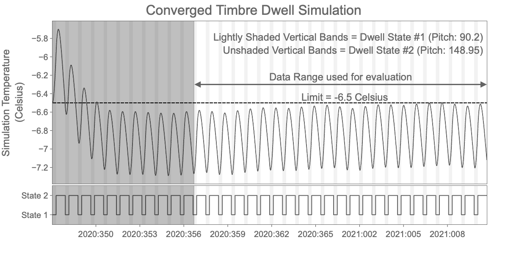
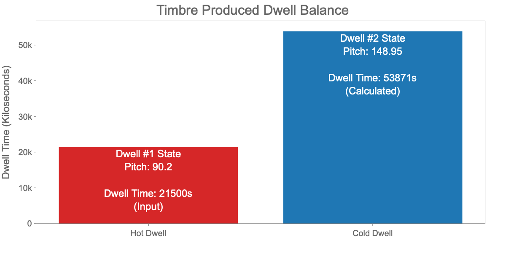
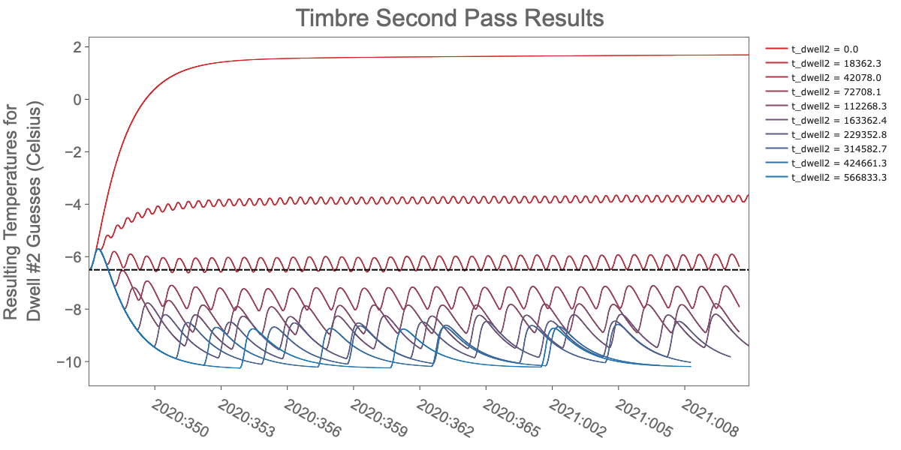
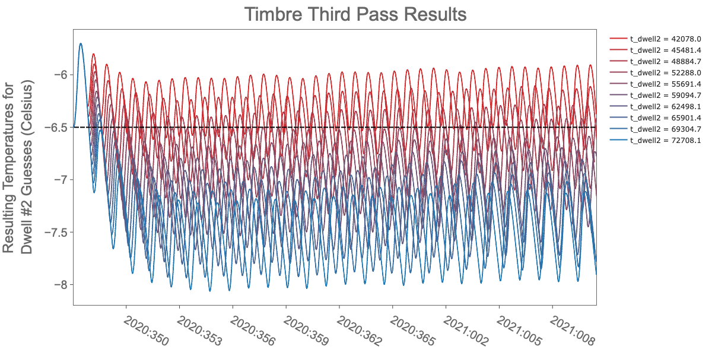
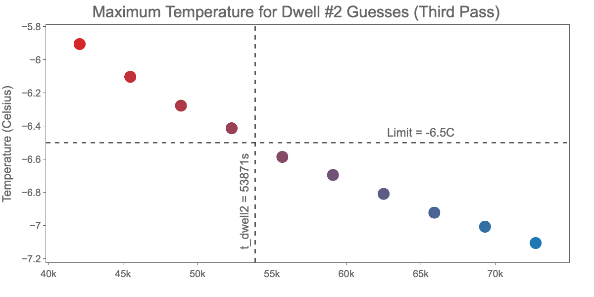
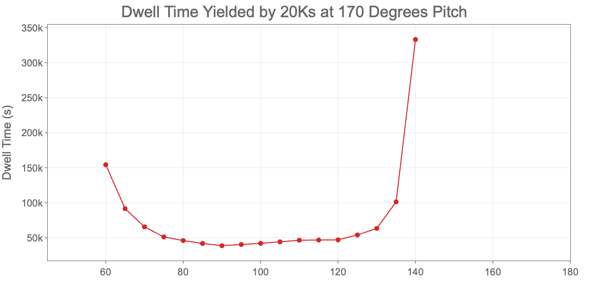
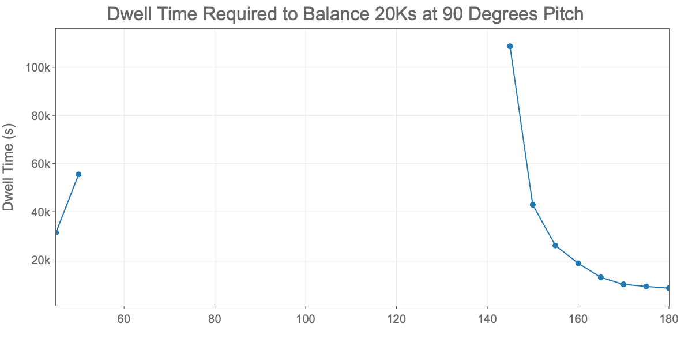
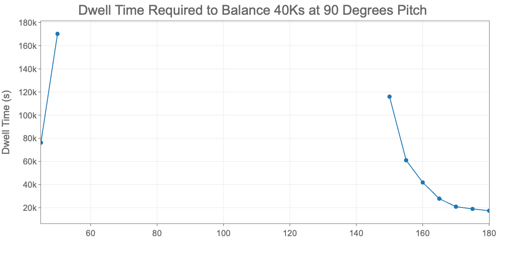
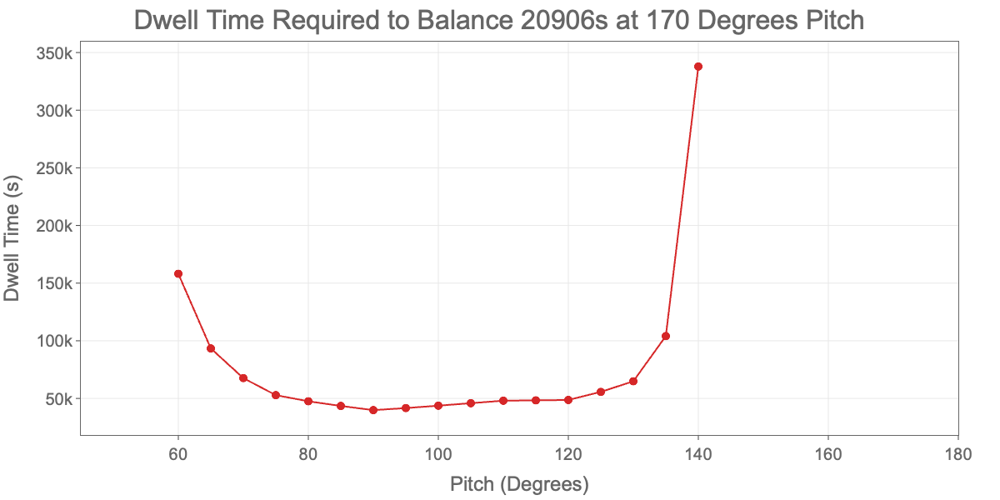
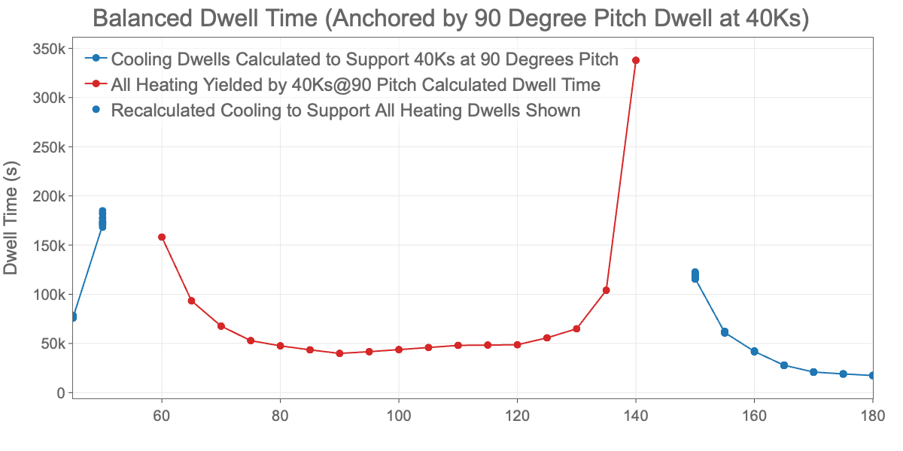

.. Timbre documentation master file, created by
   sphinx-quickstart on Tue Dec 22 14:23:10 2020.
   You can adapt this file completely to your liking, but it should at least
   contain the root `toctree` directive.

############################################
Timbre Thermal Dwell Balance Estimation Tool
############################################

The timbre package enables one to calculate the required contiguous cold time to balance a specified hot observation, or
alternatively the maximum contiguous hot time yielded by a given cold observation, for a given Xija thermal model.

The primary purpose of this package is to enable the Chandra SOT Mission Planning Team to estimate the required mix of
observations that will yield a feasible schedule, without depending on past dwell profiles that may no longer be
relevant for future schedules.

Introduction
============

As Chandra's external thermal protective surfaces degrade over time, resulting in steadily increasing heat absorption
from the sun, many components have begun to approach their health and safety thermal limits. As these components begin
to approach their limits, predictive thermal models for these locations are built using the Xija thermal modeling
framework, enabling SOT and FOT Mission Planning to plan observation schedules that maintain temperatures within
specified limits. These limits are set based on original qualification testing, material-based capability, or other
performance-based criteria, and are re-evaluated periodically to balance scheduling challenges with vehicle performance
towards optimizing science goals.

Occasionally, new locations need to be added to this set of modeled components, resulting in new planning challenges and
rendering past scheduling strategies incompatible with future scheduling requirements. The algorithm Timbre uses to
determine dwell time is independent of past profiles, and is therefore more flexible than approaches that have used
these past observing profiles to characterize future capability, which had worked very well earlier in the mission.

This documentation will first cover how to run Timbre to calculate the estimated dwell time to balance two known
configurations (e.g. pitch, roll, fep_count, etc.) and a known initial dwell time. After covering very basic usage,
further examples will cover how to run multiple simulations, and eventually how to use this data to characterize dwell
capability over a range of inputs.

Basic Usage
===========

The example below represents a situation where one has a 21500 second hot dwell at 90.2 degrees pitch that they want to
include in a schedule near January 1st, 2021. They want to know how much time at 148.95 degrees pitch that should be
included in the schedule to balance this hot dwell from an ACA perspective.

Package Imports
---------------

    >>> from cxotime import CxoTime
    >>> from timbre import get_local_model, find_second_dwell

Define Model Information
------------------------

This information defines the model being used, as well as initial starting conditions. These starting conditions do not
significantly impact the results, however it is good practice to set them to be close to realistic values.

    >>> msid = 'aacccdpt'
    >>> limit = -6.5
    >>> date = '2021:001:00:00:00'
    >>> aca_model_spec, aca_md5 = get_local_model('./timbre/tests/data/aca_spec.json')
    >>> model_init = {'aacccdpt': -6.5, 'aca0': -6.5, 'eclipse': False}

Define Dwell #1 Information
---------------------------

Define the state information for the observation that one wants to balance, such as a known hot dwell to be
included in a schedule. For the ACA model, we only need to define dwell time and pitch. Other models may need to have
more information defined. For example, the DPA model would need FEP count, CCD count, SIM position, clocking state, and
vid board state defined. Any information that the Xija model needs to run, that isn't defined in `model_init` needs to
be defined in each of the dwell state definitions, `dwell1_state` and `dwell2_state`.

    >>> t_dwell1 = 21500. # Seconds
    >>> dwell1_state = {'pitch': 90.2}

Define Dwell #2 Information
---------------------------

This state can be considered a candidate balancing dwell, such as a cooling attitude one wants to use to balance a hot
attitude. In this case we want to calculate the cold time necessary to balance the hot dwell 1 state, so we do not
define time as in input parameter. As with `dwell1_state`, `dwell2_state` still needs all information, not already in
the initialization object `model_init`, necessary to run the Xija model.

    >>> dwell2_state = {'pitch': 148.95}

Calculate Dwell #2 Time
-----------------------

    >>> results = find_second_dwell(date, dwell1_state, dwell2_state, t_dwell1, msid, limit, aca_model_spec, model_init, limit_type='max')
    >>> results
    {'converged': True,
     'unconverged_hot': False,
     'unconverged_cold': False,
     'min_temp': -7.276062645249995,
     'mean_temp': -6.856483123898791,
     'max_temp': -6.5,
     'temperature_limit': -6.5,
     'dwell_2_time': 53894.85392717416,
     'min_pseudo': nan,
     'mean_pseudo': nan,
     'max_pseudo': nan,
     'hotter_state': 1,
     'colder_state': 2}

Explanation of Results
----------------------

The following information is returned by `find_second_dwell`:
 - `converged`: This is a boolean value that indicates whether or not a solution was possible. Solutions will not be
   possible in a number of situations:

   - Both dwells heat the location being modeled.
   - Both dwells cool the location being modeled.
   - One of the states neither sufficiently heats or cools the location being modeled (this will sometimes converge but
     not always reliably).
   - The `dwell1_state` is hot and the initial dwell time is long enough to heat this location from a steady state cold
     temperature to the specified hot limit, assuming the location is associated with a maximum temperature limit. In
     the case where a location is associated with a minimum temperature limit (e.g. PLINE03T), the opposite would apply,
     the `dwell1_state` is cold and is long enough to cool this location from a steady state hot temperature to the
     specified cold limit.

 - `unconverged_hot`: If the solution didn't converge, this will be `True` if the input values resulted in temperatures
   outside (e.g. above) the specified limit.
 - `unconverged_cold`: If the solution didn't converge, this will be `True` if the input values resulted in all
   temperatures within (e.g. below) the specified limit.
 - `min_temp`: This is the minimum temperature observed during the simulation (latter 2/3 actually to allow the model to
   reach a repeatable pattern - more on this later). This will be the limit for a converged solution in the case where
   the location is associated with a minimum temperature limit (e.g. PLINE03T).
 - `mean_temp`: This is the mean temperature observed during the simulation (latter 2/3)
 - `max_temp`: This is the maximum temperature observed during the simulation (latter 2/3). This will be the limit for a
   converged solution with a maximum temperature limit (e.g. AACCCDPT).
 - `temperature_limit`: This is the limit being used.
 - **`dwell2_time`: The dwell #2 time is what you are looking to calculate, and represents the dwell #2 state duration
   that balances the dwell #1 state at the specified duration, `t_dwell1`.**
 - `min_pseudo`: This is the min pseudo node temperature observed during the evaluated portion of the simulation. This
   is not implemented yet but is intended to eventually yield additional insight into the results.
 - `mean_pseudo`: This is the mean pseudo node temperature observed during the evaluated portion of the simulation. This
   is not implemented yet.
 - `max_pseudo`: This is the max pseudo node temperature observed during the evaluated portion of the simulation. This
   is not implemented yet.
 - `hotter_state`: This is an integer indicating which state is hotter, 1 or 2.
 - `colder_state`: This is an integer indicating which state is colder, 1 or 2, and is actually redundant with
   `hotter_state`.

Batch Processing
================

Multiple sets of cases can be run using a single function call, simplifying the generation of larger datasets.

Package Imports
---------------

    >>> import numpy as np
    >>> from cxotime import CxoTime
    >>> from timbre import get_local_model, run_state_pairs

Define Model Information
------------------------

This is the same setup as used above.

    >>> msid = 'aacccdpt'
    >>> limit = -6.5
    >>> date = '2021:001:00:00:00'
    >>> aca_model_spec, aca_md5 = get_local_model('./timbre/tests/data/aca_spec.json')
    >>> model_init = {'aacccdpt': -6.5, 'aca0': -6.5, 'eclipse': False}
    >>> t_dwell1 = 21500. # Seconds

Define Dwell Cases
------------------

This is the most significant departure from above, instead of defining separate `dwell1_state` and `dwell2_state`
dictionary objects for a single case, pairs of `dwell1_state` and `dwell2_state` dictionary objects are combined into a
larger data structure. The `run_state_pairs` function will run through this data structure one pair at a time.

It should be noted that this set of cases will all use the same initial dwell time `t_dwell1` listed above.

    >>> state_pairs = (({'pitch': 144.2}, {'pitch': 154.95}),
    >>>                ({'pitch': 90.2}, {'pitch': 148.95}),
    >>>                ({'pitch': 50}, {'pitch': 140}),
    >>>                ({'pitch': 90}, {'pitch': 100}),
    >>>                ({'pitch': 75}, {'pitch': 130}),
    >>>                ({'pitch': 170}, {'pitch': 90}),
    >>>                ({'pitch': 90}, {'pitch': 170}))

Calculate Results
-----------------

    >>> results = run_state_pairs(msid, aca_model_spec, model_init, limit, date, t_dwell1, state_pairs,  limit_type='max')

Explanation of Results Format
-----------------------------

The description of the results shown above is still valid for the similarly named items, however that information is
still included here for completeness, along with descriptions of the additional included information.

 - `msid`: This is the MSID that represents the location of interest, and is the primary output of a given model.
 - `date`: This is the date for which the simulation is applicable.
 - `datesecs`: This is the same date described by `date` only in seconds using the standard Ska Chandra epoch
 - `limit`: This is the temperature limit being used.
 - `tdwell_1`: This is the initial, "known", time that corresponds to the dwell #1 state. This is fixed for a batch of
   `state_pairs`.
 - **`tdwell_2`: The dwell #2 time is what you are looking to calculate, and represents the dwell #2 state duration that
   balances the dwell #1 state at the specified duration, `t_dwell1`.**
 - `min_temp`: This is the minimum temperature observed during the simulation (latter 2/3 actually to allow the model to
   reach a repeatable pattern - more on this later). This will be the limit for a converged solution in the case where
   the location is associated with a minimum temperature limit (e.g. PLINE03T).
 - `mean_temp`: This is the mean temperature observed during the simulation (latter 2/3)
 - `max_temp`: This is the maximum temperature observed during the simulation (latter 2/3). This will be the limit for a
   converged solution with a maximum temperature limit (e.g. AACCCDPT).
 - `min_pseudo`: This is the min pseudo node temperature observed during the evaluated portion of the simulation. This
   is not implemented yet but is intended to eventually yield additional insight into the results.
 - `mean_pseudo`: This is the mean pseudo node temperature observed during the evaluated portion of the simulation. This
   is not implemented yet.
 - `max_pseudo`: This is the max pseudo node temperature observed during the evaluated portion of the simulation. This
   is not implemented yet.
 - `converged`: This is a boolean value that indicates whether or not a solution was possible. Solutions will not be
   possible in a number of situations:

   - Both dwells heat the location being modeled.
   - Both dwells cool the location being modeled.
   - One of the states neither sufficiently heats or cools the location being modeled (this will sometimes converge but
     not always reliably).
   - The `dwell1_state` is hot and the initial dwell time is long enough to heat this location from a steady state cold
     temperature to the specified hot limit, assuming the location is associated with a maximum temperature limit. In
     the case where a location is associated with a minimum temperature limit (e.g. PLINE03T), the opposite would apply,
     the `dwell1_state` is cold and is long enough to cool this location from a steady state hot temperature to the
     specified cold limit.

 - `unconverged_hot`: If the solution didn't converge, this will be `True` if the input values resulted in temperatures
   outside (e.g. above) the specified limit.
 - `unconverged_cold`: If the solution didn't converge, this will be `True` if the input values resulted in all
   temperatures within (e.g. below) the specified limit.
 - `hotter_state`: This is an integer indicating which state is hotter, 1 or 2.
 - `colder_state`: This is an integer indicating which state is colder, 1 or 2, and is actually redundant with
   `hotter_state`.
 - `pitch1`: This is the pitch used as an input to a given simulation corresponding to the dwell #1 state.
 - `eclipse1`: This is the eclipse state used as an input to a given simulation corresponding to the dwell #1 state.
 - `pitch2`: This is the pitch used as an input to a given simulation corresponding to the dwell #2 state.
 - `eclipse2`: This is the eclipse state used as an input to a given simulation corresponding to the dwell #2 state.

Results
-------

One can use Astropy to display a table similar to that shown below.

    >>> import astropy
    >>> astropy.table.Table(results)

.. include:: run_state_pairs_example_output_table.rst

Discussion of Results
---------------------

Each number corresponds to a row in the above results:

1. This simulation included a dwell #1 pitch of 144.2 degrees, and a dwell #2 pitch of 154.95 degrees. Although the
   first dwell state is warmer, this state does not sufficiently heat this model at the given date to reach the
   specified limit, so these two states together result in an unconverged cold simulation.
2. This simulation included a dwell #1 pitch of 90.2 degrees, and a dwell #2 pitch of 148.95 degrees. This solution
   converged with a dwell #2 duration of approximately 53871 seconds at 148.95 degrees pitch calculated to sufficiently
   balance 21500 seconds at 90.2 degrees pitch on 2021:001.
3. This simulation included a dwell #1 pitch of 50.0 degrees, and a dwell #2 pitch of 140.0 degrees. This solution
   converged with a dwell #2 duration of approximately 169600 seconds at 140.0 degrees pitch calculated to sufficiently
   balance 21500 seconds at 140.0 degrees pitch on 2021:001. Although this condition did result in a solution, the
   exceedingly long time necessary at the dwell #2 condition would likely not be possible due to other thermal
   constraints.
4. This simulation included a dwell #1 pitch of 90.0 degrees, and a dwell #2 pitch of 100.0 degrees. As both of these
   states heat this modeled location, no solution is possible.
5. This simulation included a dwell #1 pitch of 75.0 degrees, and a dwell #2 pitch of 130.0 degrees. As both of these
   states heat this modeled location, no solution is possible.
6. This simulation included a dwell #1 pitch of 170.0 degrees, and a dwell #2 pitch of 90.0 degrees. This solution
   converged with a dwell #2 duration of approximately 40795 seconds at 90.0 degrees pitch calculated to sufficiently
   balance 21500 seconds at 170.0 degrees pitch on 2021:001.
7. This simulation included a dwell #1 pitch of 90.0 degrees, and a dwell #2 pitch of 170.0 degrees. This solution
   converged with a dwell #2 duration of approximately 10489 seconds at 170.0 degrees pitch calculated to sufficiently
   balance 21500 seconds at 90.0 degrees pitch on 2021:001.

Background: How Timbre Works
============================

The timbre package enables one to calculate the required contiguous cold time to balance a specified hot observation, or
alternatively the maximum contiguous hot time yielded by a given cold observation, for a given Xija thermal model.

Timbre accomplishes this by generating fictitious 30 day schedules that alternate between each of the two observations
(and only those two observations), with the duration of the dwell time of interest (`t_dwell2`) being the only changing
variable, for a single Xija thermal model. If a reasonable "dwell time of interest" (`t_dwell2`) can be found that
results in the schedule reaching but not exceeding the specified limit for the thermal model being characterized, then
this simulation has converged.

*NOTE: Plotting code has been omitted from this documentation. If you wish to view this code, please see the
`documentation_material.ipynb` notebook along with the helper code in `plot_code.py`.*

Detailed View of Converged Solution
-----------------------------------

Below we take a look at such a schedule for the first converged solution from the table above.
 - The top plot primarily shows AACCCDPT temperature resulting from this Timbre simulation.
 - The bottom plot shows which dwell state is active.
 - The thin vertical shaded regions also highlight which dwell state is active.

     - The thin vertical lightly shaded regions are each 21500 seconds, corresponding to the length of `t_dwell1`.
     - The thin unshaded (white) regions in between the shaded regions are each approximately 53870 seconds,
       corresponding to the length of `t_dwell2`, which is the output of a Timbre calculation.

 - The dark shaded region on the left highlights the duration used to allow the schedule to reach a "steady state"
   oscillation, and is not used to evaluate convergence.
 - The simulation date is in the center of the evaluation period (2021:001).
 - Some small amount of instability in a Xija temperature prediction is not unusual.
 - Maximum temperatures in the evaluation region do not need to consistently reach the limit, they only need to be close
   for the ratio of `tdwell_1` to `t_dwell2` to be sufficiently accurate for the conditions being used.
 - Note that the dwell state transitions do not line up with the peaks and valleys. This is due to the "momentum" built
   into the model and accurately represents the thermal behavior of location being modeled.

The plot above is intended to provide insight into what a balanced solution looks like, by demonstrating how alternating
between two "balanced" dwells results in a relatively steady temperature profile, with the peak temperature reaching but
not exceeding the limit. In the interest of minimizing unnecessary data generation this entire profile is not returned
by Timbre, instead Timbre returns the duration of the second state, some descriptive information about the solution, and
any inputs necessary for characterizing the each state (e.g. pitch, ccd_count, etc.) as described in the Basic and
Batch Processing sections.

The plot below demonstrates the conceptual output of Timbre:

Dwell #2 Calculation Algorithm
------------------------------

Now that a more detailed view of a converged solution has been presented, next we dive into how Timbre arrives at this
solution. As stated earlier, the only dependant variable is the duration of the second dwell state, referred to as
`t_dwell2` in the data returned by Timbre. There are a number of potential approaches to determining this parameter,
from brute force to widely used optimization techniques, however the most robust and fastest technique for this
particular application has been found to be a three pass brute force + interpolation method:

 1. The first pass calculates the values for 1.e-6 and a pre-defined maximum dwell (approximately 500Ks). This serves to
    eliminate unncessary model runs when no viable solution exists.
 2. The second pass calculates the results from N logarithmically (base 10) spaced guesses for `t_dwell2`, between 1.e-6
    and the pre-defined maximum dwell. N is a keyword option, with a default value of 10. A logarithmically spaced set
    of guesses are used to yield more resolution at the smaller time durations, where the more useful (and likely more
    accurate) prediction data exists.
 3. The third pass calculates the results from N linearly spaced guesses for `t_dwell2` between the two closest values
    calculated from the second pass.
 4. The results of the third pass are used to interpolate the value of `t_dwell2`, using the values for the `t_dwell2`
    guesses and the resulting maximum temperatures observed (in the range of data used for evaluation) to determine the
    optimum value of `t_dwell2` at the limit.

To provide a visual of what the second and third passes look like, please see the following plots:

This plot is rather busy, making it difficult to estimate the likely optimum second dwell duration by eye. Instead lets
look at a plot of just the maximum temperature for each run in the duration used for evaluation (see "Converged Timbre
Dwell Simulation" plot above).

This plot shows that when starting with a fixed initial dwell of 21500 seconds, at a pitch of 90.2 degrees, the ACA
model needs 53871 seconds at 148.95 degrees pitch to maintain a balanced profile. See the plot "Converged Timbre Dwell
Simulation" plot above for a more detailed view of the schedule with this interpolated dwell #2 time.

Using Timbre to Characterize a Model the Original Way
=====================================================

Now that the methodology behind how Timbre calculates a single balance time has been presented, the next step is to
expand this capability to characterize a model by varying the input parameters.

Characterization Using a Fixed Initial Dwell Duration
-----------------------------------------------------

First, we focus on varying the dwell #1 and dwell #2 pitch values, while keeping a fixed Dwell #1 value of 20000s. This
will give us a picture of the value of a 20Ks cold initial dwell in terms of yielded hot time, or the cost of a 20000s
hot initial dwell in terms of cooling time.

    >>> msid = 'aacccdpt'
    >>> limit = -6.5
    >>> date = '2021:001:00:00:00'
    >>> aca_model_spec, aca_md5 = get_local_model('../timbre/tests/data/aca_spec.json')
    >>> model_init = {'aacccdpt': -6.5, 'aca0': -6.5, 'eclipse': False}
    >>> t_dwell1 = 20000. # Seconds
    >>> state_pair_dtype = {'pitch': np.float64}

|

Instead of defining each pitch condition manually, they are defined programatically.

    >>> state_pairs = [({'pitch': p1}, {'pitch': p2}) for p1 in range(45, 181, 5) for p2 in range(45, 181, 5)]
    >>> results = run_state_pairs(msid, aca_model_spec, model_init, limit, date, t_dwell1, state_pairs, limit_type='max')

|

Display the first ten lines.

    >>> import astropy
    >>> astropy.table.Table[:10](results)

.. include:: model_characterization_table.rst

Now we can start exploring this data. We won't plot all the data we just generated, however it would be useful to see
how this data looks over the observable pitch range. First look at the duration of hot time made available by a 20Ks
dwell at 170 degrees pitch.

Now look at a reverse situation where we want to know how much cooling time would be required to balance a 20Ks hot
dwell at 90 degrees pitch.

We could combine these data into a single plot, however as these data are not directly comparable, displaying these two
results together can result in more confusion than clarity. For example, 20ks of dwell time at 170 degrees pitch on
2021:001 will yield approximately 38.6Ks of available hot time at 90 degrees pitch (shown on the red line), and 20Ks of
hot time at 90 degrees pitch requires approximately 9.750Ks of cold time to balance this 20Ks hot dwell (shown on the
blue line), therefore the cooling (blue) data does not represent the time necessary to balance the shown heating (red)
dwells.

The next section describes how to produce heating and cooling dwell times that do balance each other, and can be
intuitively displayed on the same chart.

Using Timbre to Plot Balanced Heating and Cooling Time
------------------------------------------------------

Instead of plotting heating and cooling durations for a fixed initial dwell time, which result in heating and cooling
(red and blue) curves that are not directly comparable, we anchor a plot at a single heating condition and dwell time
and use this as a starting point to build a set of heating and cooling curves that are directly comparable.

These are the basic steps that we'll follow to produce a single balanced dwell time plot.

1. Pick a representative hot attitude along with a hot dwell time, for this example we use the ACA model, with an
   initial dwell at 90 degrees for 40Ks.
2. Determine the cooling time to support this duration at all attitudes (we will only plot converged results).
3. From the converged results generated in step 2, pick a representative cooling attitude and note the calculated
   cooling time. For this example we use 170 degrees, with the dwell time calculated in step 2 for this pitch.
4. Determine the hot time yielded by this cold dwell, this should include the 40Ks at 90 degrees pitch as a result (or
   very close), along with the proportional heating time at other pitch values.
5. As a sanity check, back calculate the associated cooling times using each pitch + dwell 2 time output from step 4.
6. Repeat steps 1-4 (step 5 can be optional) for other initial hot dwell times.

First, as before, we load the model and define the baseline conditions

    >>> msid = 'aacccdpt'
    >>> limit = -6.5
    >>> date = '2021:001:00:00:00'
    >>> aca_model_spec, aca_md5 = get_local_model('../timbre/tests/data/aca_spec.json')
    >>> model_init = {'aacccdpt': -6.5, 'aca0': -6.5, 'eclipse': False}

|

Next, we pick a representative hot dwell and an associated initial dwell time that we want to balance. The only rule in
picking this representative hot dwell is that it is not near a "transition region" so that the balance time can be
reliably calculated. I picked 90 degrees pitch as it is far enough from a transition region, and is often considered one
of the hottest attitudes for this location (ACA).

A hot dwell of 40Ks is chosen as the balance hot dwell time since this is close to the maximum hot time that is commonly
calculated. There is no rule that defines how to pick this specific dwell time, and one may want to re-run this analysis
with different initial dwell times to expand the characterization of this model.

A range of destination pitch values is chosen. The entire pitch range is used rather than those that are known to be
cooling pitch values, as it is best not to assume which attitudes cool or heat.

    >>> phot = 90
    >>> thot = 40000
    >>> state_pairs = [({'pitch': phot}, {'pitch': p2}) for p2 in range(45, 181, 5)]
    >>> results1 = run_state_pairs(msid, aca_model_spec, model_init, limit, date, thot, state_pairs, limit_type='max')

|

The next plot shows the dwell time, at various cooling attitudes, required to balance the 40Ks hot dwell at 90 degrees
pitch. It is very important to recognize that all the cooling data shown below are equivalent in balancing the chosen
hot dwell parameters.

After determining the various cooling times that balance the chosen hot dwell parameters, a representative cooling
attitude is chosen from the data shown above. As in Step 1, we want a value that is not near a transition region. I
chose 170 degrees as this is also a commonly recognized cooling attitude for the ACA. A cooling time of 20.906Ks at 170
degrees pitch is calculated to balance the original 40Ks hot dwell at 90 degrees pitch (as shown above). This dwell time
and attitude now serve as the initial dwell parameters used to calculate the available heating time at all heating
attitudes (not just at 90 degrees).

    >>> pcool = 170
    >>> tcool_ind = results1['pitch2'] == pcool
    >>> tcool = results1['t_dwell2'][tcool_ind].item()
    >>> state_pairs = [({'pitch': pcool}, {'pitch': p2}) for p2 in range(45, 181, 5)]
    >>> results2 = run_state_pairs(msid, aca_model_spec, model_init, limit, date, tcool, state_pairs, limit_type='max')

At this point, the two charts above can be combined into the same plot to intuitiviely display balanced dwell
information, however first it would be useful to include a sanity check to verify that these curves (red and blue) are
indeed comparable and result in a balanced set of dwells. To perform this sanity check, each hot attitude and associated
heating time shown in the plot above is used to recalculate the associated cooling time required to balance each hot
dwell. We would expect that, since all heating data displayed above are equivalent in their ability to balance the
cooling dwell chosen to produce the above plot, and since all the cooling data shown above in the prior plot are
equivalent in their ability to balance the original heating dwell chosen in Step 1, that this recalculation of the
cooling data would result in identical cooling data to those shown above in Step 1.

    >>> hot_ind = (results2['t_dwell2'][results2['converged']] < 100000)
    >>> results3 = np.array([], dtype=results.dtype)
    >>> for result in results2[results2['converged']][hot_ind]:
    >>>     state_pairs = [({'pitch': result['pitch2']}, {'pitch': p2}) for p2 in range(45, 181, 5)]
    >>>     t = result['t_dwell2']
    >>>     rnew = run_state_pairs(msid, aca_model_spec, model_init, limit, date, t, state_pairs, limit_type='max')
    >>>     results3 = np.hstack((results3, rnew))

|

The data above are now shown below in the same chart, listed as the first two entries in the plot legend. The
recalculated cooling data are shown simply as a cloud of blue dots, without connecting lines. As expected, the
recalculated cooling data is almost identical to the original cooling curve, with the exception of the values near the
transition regions, where this location neither heats or cools quickly. This scatter in the data near the transition
regions is not surprising, as these regions are both difficult to accurately predict in nominal schedules and difficult
to characterize by Timbre and Pyger.

This analysis can now be repeated for different "anchoring" conditions, and for different models.

.. The toctree directive is kept below for future enhancement, however currently it does not produce any resulting text.

.. toctree::
   :maxdepth: 2
   :caption: Contents:

API documentation
=================

.. automodule:: timbre.timbre
   :members:

Indices and tables
==================

* :ref:`genindex`
* :ref:`modindex`
* :ref:`search`
